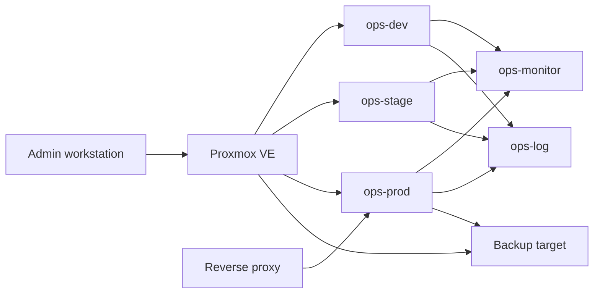

# Debian Service Operations Architecture

Last updated: 2026-05-03

This document defines the production-like Debian operations lab used for staged patching, validation, monitoring, logging, backups, and recovery drills.

## Goals

- Practice safe service maintenance with separate dev, staging, and production targets.
- Keep host configuration rebuildable through documented playbooks and runbooks.
- Produce evidence for upgrades, validation, monitoring, backups, and restore drills.
- Avoid coupling the lab to existing household services where failure would be disruptive.

## Physical and Virtual Layout

Two Proxmox VE nodes provide the base infrastructure:

| Node | DNS name | Role in lab | Notes |
|------|----------|-------------|-------|
| Athena | `proxmox-a.example.internal` | Primary virtualization and storage node | Existing home services, NAS, reverse proxy, Docker host |
| Zeus | `proxmox-b.example.internal` | Secondary virtualization node | Existing dev VM, Home Assistant, media services |

The service operations lab should use dedicated Debian VMs instead of existing production containers. The expected target layout is:

| Role | Proposed hostname | Environment | Primary purpose | Placement | IP/DNS notes |
|------|-------------------|-------------|-----------------|-----------|--------------|
| Dev service VM | `ops-dev.example.internal` | Dev | Fast iteration for playbooks, validation checks, and package changes | Zeus or Athena | Assign static DHCP or documented static IP |
| Staging service VM | `ops-stage.example.internal` | Staging | Clone-like target for testing production maintenance before release | Same node/storage class as prod when possible | Assign static DHCP or documented static IP |
| Production service VM | `ops-prod.example.internal` | Prod | Portfolio service target behind reverse proxy | Athena preferred | Assign static DHCP or documented static IP |
| Monitoring VM | `ops-monitor.example.internal` | Shared | Prometheus/Zabbix, alerting, and dashboards | Zeus preferred to monitor Athena failures | Assign static DHCP or documented static IP |
| Logging VM | `ops-log.example.internal` | Shared | Central journald/syslog/Loki collection | Zeus preferred | Assign static DHCP or documented static IP |
| Backup target | `ops-backup.example.internal` or NAS path | Shared | Off-host backup landing zone and restore evidence | TrueNAS or protected storage | Document dataset, retention, and access policy |

Final IP addresses should be recorded after VM creation in `docs/inventory.md` or the Ansible inventory.

## Network Segments

| Segment | Purpose | Expected access |
|---------|---------|-----------------|
| Home LAN | Existing trusted management network | SSH from admin workstation to Proxmox and lab VMs |
| Service network | Debian service VMs and app traffic | Reverse proxy to prod service ports only |
| Monitoring/logging path | Metrics, logs, and alert traffic | Lab VMs push or expose metrics/logs to shared monitoring services |
| Backup path | VM backups and restore artifacts | Proxmox and backup target access only |

The first implementation can stay on the current home LAN if VLANs are not ready. When VLANs are introduced, update firewall rules and routing assumptions here before changing hosts.

## Storage Assumptions

- VM disks live on Proxmox-managed storage with snapshot support where available.
- Production and staging should use comparable disk layouts so restore and upgrade drills reflect real conditions.
- Backups must leave the VM host, either to TrueNAS, protected backup storage, or another documented off-host location.
- Restore drills should target an isolated VM name or staging slot to avoid overwriting production.

## Service Model

The capstone service should be intentionally ordinary: a small web app behind Nginx with PostgreSQL persistence. That keeps the operational focus on maintenance, validation, rollback, and evidence instead of app complexity.

## Maintenance Workflow

1. Open or select a Linear issue for the planned maintenance.
2. Confirm current inventory, host health, backup status, and rollback plan.
3. Snapshot or back up the production service VM before making changes.
4. Apply playbook or package changes in dev.
5. Promote the exact change set to staging.
6. Run the validation suite against staging and record pass/fail output.
7. Approve production only when staging validation passes and rollback criteria are clear.
8. Apply the production change.
9. Run post-change validation and save a dated maintenance report.
10. Update the change log with commands, results, failures, fixes, and follow-up work.

## Promotion Criteria

| Gate | Required evidence |
|------|-------------------|
| Dev to staging | Playbook or script completes without unhandled errors |
| Staging to prod | Validation report passes required services, ports, HTTP checks, disk checks, and database checks |
| Prod complete | Post-change validation passes and monitoring/logging show no unexpected failures |
| Rollback | Backup or snapshot exists, restore path is known, and rollback trigger is documented |

## Documentation Outputs

The project should produce these artifacts as the lab matures:

- Ansible inventory and playbooks for the Debian baseline.
- Hardening baseline runbook and validation checks.
- Staged patching runbook with package hold and apt source controls.
- Dated maintenance reports for staging and production runs.
- Monitoring alert rules and evidence of a test alert.
- Central log and change/incident log examples.
- Backup configuration and restore drill report with RPO/RTO.
- Capstone upgrade runbook with lessons learned and interview talking points.
